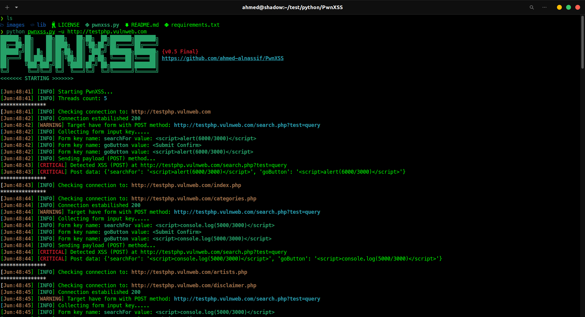

# Powerful XSS Scanner - PwnXSS
# Description
PwnXSS is a powerful and versatile XSS (Cross-Site Scripting) scanner that provides a wide range of features to help security researchers and web developers identify and mitigate XSS vulnerabilities in web applications. Developed in Python 3, PwnXSS offers a user-friendly interface, advanced crawling capabilities, support for both GET and POST forms, and extensive customization options.

# Installing 

## Requirements
<li> python 3 </li>
<br/>

## Installation Steps

```bash
git clone --depth=1 https://github.com/ahmed-alnassif/PwnXSS
chmod 755 -R PwnXSS
cd PwnXSS
python3 -m pip install -r requirements.txt
python3 pwnxss.py --help 
```
## Usage
Basic usage:

```bash
python3 pwnxss.py -u http://testphp.vulnweb.com
```
<br/>
Advanced usage:

```bash
python3 pwnxss.py --help
```

# Main Features
<li>Crawls all links on a website (crawler engine)</li>
<li>Supports POST and GET forms</li>
<li>Highly customizable with many settings</li>
<li>Advanced error handling</li>
<li>Multiprocessing support</li>
<li>And more...</li>


## Screenshot
<div style="align: center; text-align: center;">

</div>

## Roadmap

v0.3B:
------
<li> Added custom options ( --proxy, etc... )</li>
<br/>

v0.3B Patch:
------
<li>Added support for ( form method GET ) </li>

v0.4B:
------
<li>Improved error handling</li>
<li>Added support for multiple parameters in GET method</li>

v0.5 Release:
------
* Bug fixed
* Added support for cookies (--cookie {})
## v1.0 Release (Final):
------
* Issues fixed and further improvements made
* Added support for threads default 5 (--thread)
* Added support for random User-Agent (--random-user-agent)

## Notes
* When running PwnXSS on the Windows 10 terminal, the output may appear untidy.
* Currently, DOM (Document Object Model) support is not implemented.
